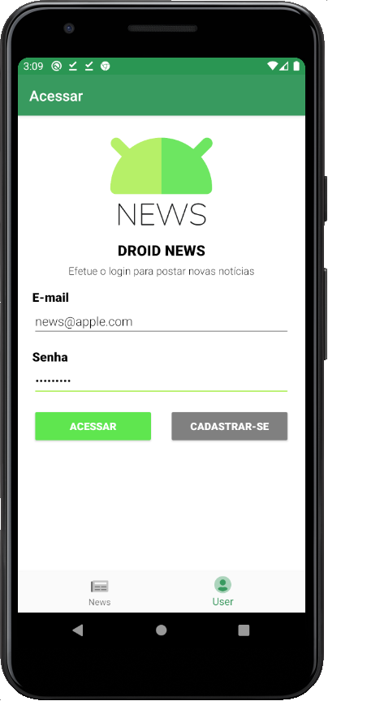
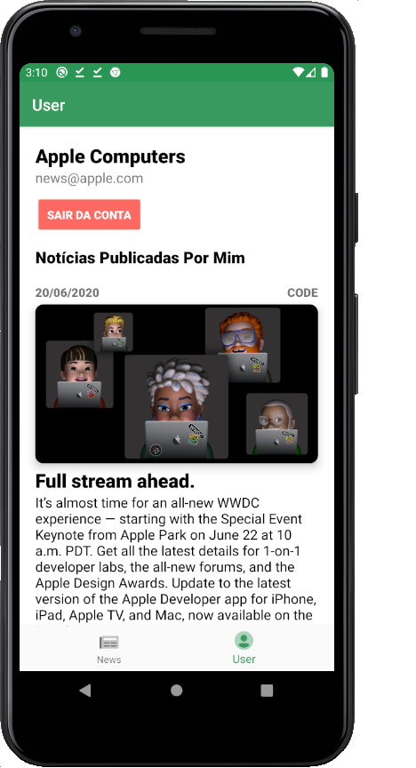
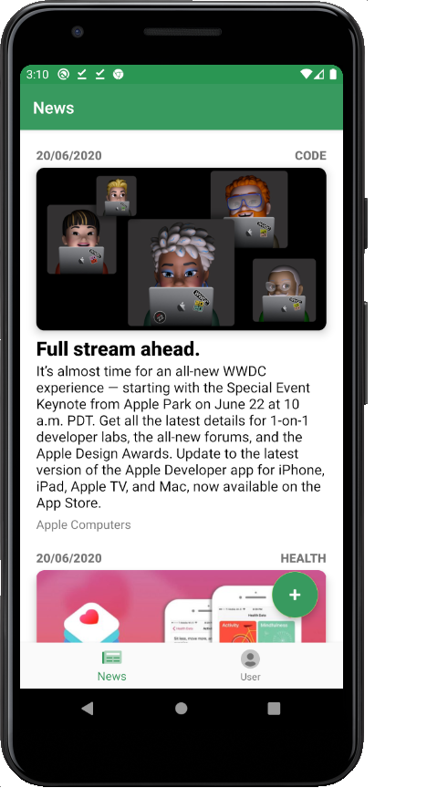

<h1>
 Droid News 
</h1>

## Visão Geral do Software

O aplicativo tem como objetivo ler e/ou publicar informações (notícias) de forma rápida, prática e interativa.

## Requisitos funcionais, papéis, quais são os usuários e o que cada usuário pode fazer?

Pode-se utilizar o app de dois modos:

* O primeiro modo é utilizar sem fazer o login ou cadastro. Com isso, o usuário apenas poderá ler as notícias publicadas por outros usuários.
* O segundo modo é utilizar fazendo login ou cadastro. Nesse modo de uso, o usuário poderá ler notícias e também pulicar uma nova notícia. Com isso, o indivíduo logado terá acesso a duas abas exclusivas, sendo essas:
  * Aba de usuário: Aqui ele poderá efetuar logout e/ou visualizar suas publicações;
  * Aba de postagem: Aqui ele poderá escrever um nova publicação contendo título, mensagem, tag e imagem;
  
O aplicativo está conectado a uma Web API. Diante disso, toda nova postagem é carregada em tempo real para todos os outros usuário.

## Screenshots

